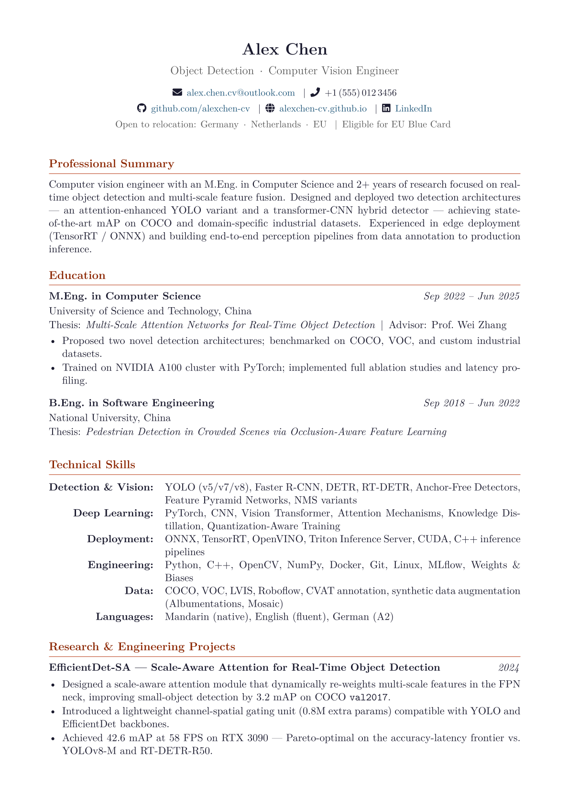

# 📄 Clean LaTeX CV Template — Computer Vision Engineer

A minimal, professional LaTeX CV template designed for ML / Computer Vision engineers seeking industry or research positions. Overleaf-ready, zero-config.

## Preview

<p align="center">
  
</p>

## Features

- **Clean typography** — Latin Modern fonts with small-caps section headers and accent-colored rule lines
- **FontAwesome5 icons** — email, phone, GitHub, LinkedIn, globe
- **Custom commands** — `\cventry`, `\cvproject`, `\skillrow` for consistent formatting
- **Color theming** — change 4 hex values in `:root` to reskin the entire CV
- **Overleaf-ready** — compiles with pdfLaTeX out of the box, no extra packages needed
- **2-page layout** — fits comfortably for 2–5 years of experience

## Quick Start

### Option 1: Overleaf (recommended)
1. Download `CV_Template.tex`
2. Go to [Overleaf](https://www.overleaf.com/) → **New Project** → **Upload Project**
3. Upload the `.tex` file
4. Set compiler to **pdfLaTeX**
5. Click **Recompile**

### Option 2: Local
```bash
pdflatex CV_Template.tex
pdflatex CV_Template.tex   # run twice for hyperref
```

## Customization

### Change colors
Edit the color block near the top of the file:

```latex
\definecolor{accentcolor}{HTML}{8B2500}   % Section title color
\definecolor{rulecolor}{HTML}{c45d3e}     % Horizontal rule color
\definecolor{linkblue}{HTML}{1a5276}      % Hyperlink color
```

### Key commands

| Command | Usage | Example |
|---------|-------|---------|
| `\cventry{Title}{Date}{Content}` | Education, experience | `\cventry{M.Eng. in CS}{2022--2025}{University...}` |
| `\cvproject{Title}{Date}{Content}{Tech}` | Projects with tech stack | `\cvproject{YOLOv9-Lite}{2024}{...}{PyTorch, CUDA}` |
| `\skillrow{Category}{Skills}` | Inside `tabularx` | `\skillrow{Deep Learning}{PyTorch, CNN, ViT}` |

### Adapt to your field
This template uses an **object detection engineer** as the example persona. To adapt:
1. Replace the header info (name, contact, links)
2. Rewrite the Professional Summary
3. Swap projects and skills for your domain
4. Update Awards and Education

## Structure

```
.
├── CV_Template.tex       # Main LaTeX source
├── README.md             # This file
└── preview.png           # Screenshot for README (add your own)
```

## Requirements

- TeX Live 2022+ or Overleaf
- Packages (all standard): `geometry`, `fontenc`, `lmodern`, `enumitem`, `titlesec`, `xcolor`, `hyperref`, `fontawesome5`, `tabularx`

## License

MIT — free to use, modify, and distribute. No attribution required (but appreciated).
